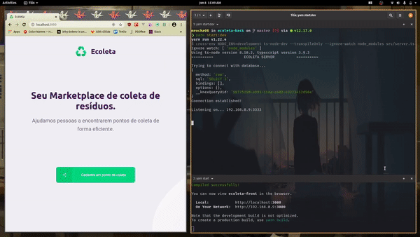

# Ecoleta ♻️🚀 (Front-End)


[](http://commitizen.github.io/cz-cli/)


[](https://github.com/styled-components/styled-components)

Um marketplace de coleta de resíduos. Desenvolvido na primeira edição da Next Level Week da Rocketseat.

## 💼 Projeto

O Ecoleta foi criado durante a [Semana Mundial do Meio Ambiente (IBEW)](https://www.ibew.sg/), e tem como finalidade divulgar pontos de coleta de resíduos, como por exemplo, óleo de cozinha, pilhas, lâmpadas, e etc.

Confira uma prévia:

🌐 Web:



📱Mobile:


Para o front-end, foi utilizado:

- Typescript
- React
- React Dropzone
- React Leaflet
- Styled Components
- SweetAlert2
- Yup
- Vercel para deploy

## ⚙ Como rodar o front-end

Antes de tudo, instale configure o [back-end](https://github.com/mrocha98/ecoleta-back/blob/master/README.md#-como-rodar-o-back-end).

Em seguida, execute os comandos:

```bash
git clone https://github.com/mrocha98/ecoleta-front #clona o repositório para sua máquina
cd ecoleta-front #entra no diretório do repositório
yarn install #instala as dependências
```

Agora é necessário que você crie um arquivo .env na raiz do projeto, e preencha com as informações do seu ambiente de desenvolvimento. Confira o arquivo [.env.example](https://github.com/mrocha98/ecoleta-front/blob/master/.env.example).

Após preencher, execute:

```bash
yarn start #executa a aplicação em modo de desenvolvimento
```

Se tudo ocorreu bem, seu navegador padrão abrirá uma nova guia no endereço `localhost:3000`.

## 🚀 Deploy

Para o deploy do front-end foi utilizada a plataforma Vercel. Confira em:
`https://ecoleta-lime.now.sh/`

## 📜 Licença

Este projeto foi construído sob a licença BSD 2-Clause.
Clique [aqui](https://github.com/mrocha98/ecoleta-front/blob/master/LICENSE) para conferir mais detalhes.
